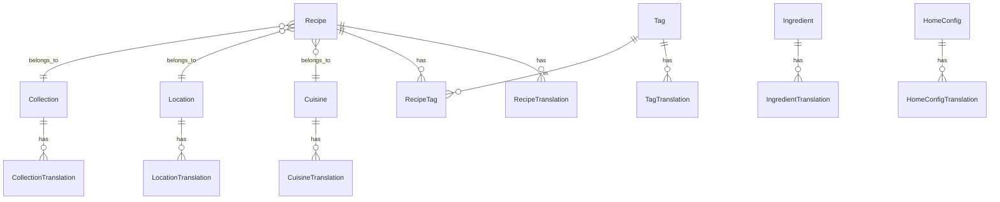

# 数据库表结构详细文档

本文档基于 `prisma/schema.prisma` 生成，详细描述了系统的数据库表结构。

**更新时间**: 2026-01-07
**Prisma 版本**: v2.0 (多语言架构)

---

## 1. 实体关系图 (ERD)

---

## 2. 核心业务表

### 2.1 Recipe (食谱主表)
存储食谱的中文原始内容及核心元数据。

| 字段名 | 类型 | 必填 | 默认值 | 说明 |
|---|---|---|---|---|
| id | String (CUID) | 是 | - | 主键 |
| slug | String | 是 | - | URL标识 (Unique) |
| title | String | 是 | - | 中文菜名 |
| description | String | 否 | - | 一句话介绍 |
| difficulty | String | 否 | - | 难度 (easy/medium/hard) |
| prepTime | Int | 否 | - | 准备时间(分钟) |
| cookTime | Int | 否 | - | 烹饪时间(分钟) |
| servings | String | 否 | - | 份量 |
| summary | Json | 否 | - | 摘要信息 (RecipeSummary) |
| story | Json | 否 | - | 文化故事 (RecipeStory) |
| ingredients | Json | 是 | - | 食材列表 (IngredientSection[]) |
| steps | Json | 是 | - | 烹饪步骤 (RecipeStep[]) |
| nutrition | Json | 否 | - | 营养信息 |
| coverImage | String | 否 | - | 封面图URL |
| styleGuide | Json | 否 | - | 风格指南 |
| imageShots | Json | 否 | - | 配图方案 |
| status | String | 是 | "draft" | 状态: draft/pending/published/archived |
| reviewStatus | String | 是 | "pending" | 审核: pending/approved/rejected |
| aiGenerated | Boolean | 是 | false | 是否AI生成 |
| transStatus | Json | 是 | "{}" | 翻译状态概览 |
| cuisineId | String | 否 | - | 关联菜系 |
| locationId | String | 否 | - | 关联地域 |
| collectionId | String | 否 | - | 关联分类合集 |

### 2.2 RecipeTranslation (食谱翻译表)
存储食谱的多语言版本。

| 字段名 | 类型 | 必填 | 说明 |
|---|---|---|---|
| id | String | 是 | 主键 |
| recipeId | String | 是 | 关联 Recipe.id |
| locale | String | 是 | 语言代码 (en, ja...) |
| title | String | 是 | 翻译标题 |
| slug | String | 是 | 英文URL标识 |
| summary | Json | 否 | 翻译摘要 |
| story | Json | 否 | 翻译故事 |
| ingredients | Json | 否 | 翻译食材 |
| steps | Json | 否 | 翻译步骤 |
| transMethod | String | 否 | ai/manual/hybrid |

---

## 3. 分类与标签系统

### 3.1 Collection (合集表)
专题策划与分类集合。

| 字段名 | 类型 | 说明 |
|---|---|---|
| id | String | 主键 |
| type | String | 类型: cuisine/scene/method/taste/crowd/occasion/topic |
| name | String | 合集名称 |
| slug | String | URL标识 |
| rules | Json | 自动匹配规则 |
| seo | Json | SEO元数据 |

### 3.2 Cuisine (菜系表)
| 字段名 | 类型 | 说明 |
|---|---|---|
| id | String | 主键 |
| name | String | 菜系名 (Unique) |
| slug | String | URL标识 |
| isActive | Boolean | 是否启用 |

### 3.3 Location (地域表)
| 字段名 | 类型 | 说明 |
|---|---|---|
| id | String | 主键 |
| name | String | 地域名 (Unique) |
| slug | String | URL标识 |

### 3.4 Tag (标签表)
多维度标签管理。

| 字段名 | 类型 | 说明 |
|---|---|---|
| id | String | 主键 |
| type | String | scene/taste/method/crowd/occasion |
| name | String | 标签名 |
| slug | String | URL标识 |
| color | String | 标签颜色 |

---

## 4. 食材库

### 4.1 Ingredient (食材表)
标准食材库。

| 字段名 | 类型 | 说明 |
|---|---|---|
| id | String | 主键 |
| name | String | 食材名 (Unique) |
| category | String | meat/vegetable/seasoning/other |
| unit | String | 默认单位 |
| iconKey | String | 图标标识 |

---

## 5. 任务与队列

### 5.1 GenerateJob (AI生成任务)
| 字段名 | 类型 | 说明 |
|---|---|---|
| id | String | 主键 |
| sourceType | String | collection/custom |
| lockedTags | Json | 锁定的标签条件 |
| status | String | pending/running/completed/failed |
| results | Json | 生成结果列表 |

### 5.2 TranslationJob (翻译任务)
| 字段名 | 类型 | 说明 |
|---|---|---|
| id | String | 主键 |
| entityType | String | recipe/collection... |
| entityId | String | 目标ID |
| targetLang | String | 目标语言 |
| status | String | 状态 |

---

## 6. 系统配置

### 6.1 AIConfig (AI配置)
存储各模块的 AI Provider 配置。

### 6.2 SiteConfig (站点配置)
全局站点设置，多语言支持配置。

### 6.3 HomeConfig (首页配置)
首页各区块(Section)的内容配置。

---

## 7. 用户与权限

### 7.1 User
| 字段名 | 类型 | 说明 |
|---|---|---|
| id | String | 主键 |
| email | String | 邮箱 (Unique) |
| role | String | user/editor/admin |

### 7.2 AIConversation
保留的 AI 对话历史记录表。
