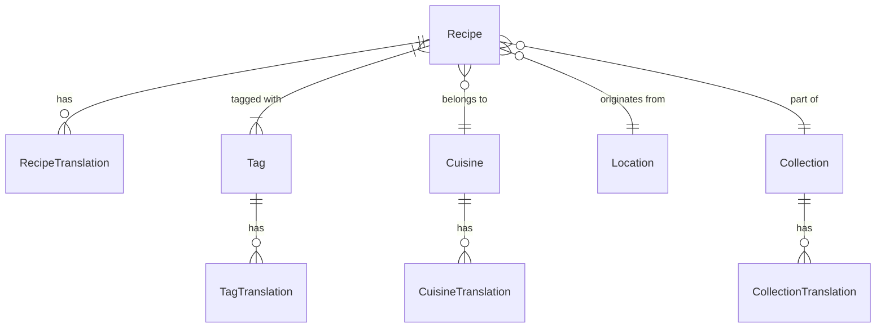

# 数据结构与架构文档

本文档详细描述了 "Recipe Zen" 美食网站项目的数据结构设计。系统采用双层数据架构：**应用层**（TypeScript/Zod）用于前端交互与业务逻辑，**存储层**（Prisma/PostgreSQL）用于持久化存储与多语言支持。

---

## 1. 核心领域模型 (应用层)

应用层数据结构严格遵循 PRD v1.1.0 规范，定义在 `types/recipe.ts` 中。

### 1.1 食谱 (Recipe)
核心实体，包含食谱的所有展示信息。

| 字段 | 类型 | 说明 | 主要子结构 |
|---|---|---|---|
| schemaVersion | `"1.1.0"` | 版本控制 | - |
| titleZh | `string` | 中文标题 | - |
| titleEn | `string?` | 英文标题 | - |
| summary | `RecipeSummary` | 核心摘要 | 难度, 耗时, 治愈文案 |
| story | `RecipeStory` | 文化故事 | 标题, 内容, 标签 |
| ingredients | `IngredientSection[]` | 食材清单 | 分组(主料/配料), 详细食材项 |
| steps | `RecipeStep[]` | 制作步骤 | 动作, 语音, 计时器, 视觉线索, 失败点, 配图指令 |
| styleGuide | `StyleGuide` | 视觉风格 | 主题, 光线, 构图, 美学 |
| imageShots | `ImageShot[]` | 配图方案 | 图片Key, 提示词, 比例 |
| tags | `RecipeTags?` | 标签维度 | 场景, 烹饪法, 口味, 人群, 场合 |
| nutrition | `RecipeNutrition?` | 营养成分 | 热量, 蛋白, 脂肪, 碳水等 |

### 1.2 关键子结构

#### 摘要 (RecipeSummary)
```typescript
interface RecipeSummary {
  oneLine: string;        // 一句话描述 ("麦香与肉脂的微醺共舞")
  healingTone: string;    // 治愈文案
  difficulty: "easy" | "medium" | "hard";
  timeTotalMin: number;   // 总耗时
  timeActiveMin: number;  // 操作时间
  servings: number;       // 份量
}
```

#### 制作步骤 (RecipeStep)
```typescript
interface RecipeStep {
  id: string;             // step01
  title: string;          // 步骤标题
  action: string;         // 详细操作
  speechText: string;     // 语音播报文本
  timerSec: number;       // 计时器(秒)
  visualCue: string;      // 视觉状态检查 ("水面浮起灰色浮沫")
  failPoint: string;      // 避坑指南 ("煮太久肉质变老")
  photoBrief: string;     // AI生图简述
}
```

#### 配图方案 (ImageShot)
```typescript
interface ImageShot {
  key: string;            // cover, step01, final
  imagePrompt: string;    // AI生图提示词
  ratio: "16:9" | "4:3" | "3:2";
  imageUrl?: string;      // 生成后的图片URL
}
```

---

## 2. 数据库架构 (存储层)

基于 Prisma ORM 设计，支持多语言扩展。定义在 `prisma/schema.prisma`。

### 2.1 核心表关系图


### 2.2 食谱模型 (Recipe Model)
主表存储中文原始内容及结构化JSON数据。

| 字段 | 类型 | 说明 |
|---|---|---|
| id | String (CUID) | 主键 |
| slug | String (Unique) | URL友好标识 |
| title | String | 菜名 (中文) |
| ingredients | JSON | 对应应用层 `IngredientSection[]` |
| steps | JSON | 对应应用层 `RecipeStep[]` |
| styleGuide | JSON | 对应应用层 `StyleGuide` |
| status | String | draft / pending / published / archived |
| transStatus | JSON | 翻译状态追踪 `{"en": "completed"}` |

### 2.3 翻译模型 (RecipeTranslation)
用于存储多语言版本。

| 字段 | 类型 | 说明 |
|---|---|---|
| recipeId | String | 关联主食谱 |
| locale | String | 语言代码 (en, ja, ko...) |
| title | String | 翻译后的标题 |
| summary | JSON | 翻译后的摘要 |
| steps | JSON | 翻译后的步骤 |
| transMethod | String | ai / manual / hybrid |

### 2.4 分类与标签系统
- **Collection (合集)**: 专题策划，如"川菜入门", "深夜食堂"。
- **Cuisine (菜系)**: 传统分类，如"川菜", "粤菜"。
- **Location (地域)**: 地理维度，如"四川", "广东"。
- **Tag (标签)**: 多维度标签 (场景/口味/人群/场合)。

### 2.5 任务队列系统
- **GenerateJob**: AI生成任务追踪，记录Prompt、状态、结果。
- **TranslationJob**: 异步翻译任务队列，支持优先级管理。

---

## 3. 数据验证 (Validator)

使用 Zod 进行运行时数据验证，确保 AI 生成数据符合 UI 渲染要求。
源文件: `lib/validators/recipe.ts`

- **RecipeSchema**: 完整食谱验证
- **SummarySchema**: 摘要验证
- **IngredientsSchema**: 食材结构验证 (涵盖 IconKey 枚举)
- **StepsSchema**: 步骤逻辑验证
- **Strict Constraints**:
  - 必须包含 schemaVersion
  - string 字段非空检查
  - number 字段正数/非负检查
  - Enum 字段 (Difficulty, IconKey, Ratio) 严格匹配

---

## 4. AI 集成类型

定义 AI 服务商交互的标准接口。
源文件: `lib/ai/types.ts`

### 4.1 Provider 接口
```typescript
interface AIProvider {
  chat(options: ChatCompletionOptions): Promise<ChatCompletionResponse>;
  chatStream(options, onChunk): Promise<ChatCompletionResponse>;
}

interface ImageProvider {
  generateImage(options): Promise<{ url: string }>;
}
```

### 4.2 配置与消息
- **AIProviderConfig**: 支持 `deepseek` | `openai`，包含 apiKey 和 baseURL。
- **ChatMessage**: 标准 `user` | `assistant` | `system` 消息结构。
